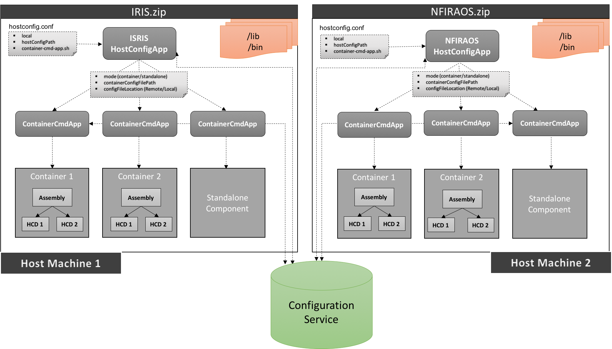

# csw-host-config

This is just a helper to create a host configuration application. 
A component/subsystem can create their own host configuration application using this helper; 
to be more precise, every Github repository should have one host configuration application. 
The reason for having one app per repo is, when you run `universal:publish` task,
it will generate a zip file which will be self contained (will have all the required dependencies) and can be deployed independently on any machine.

This application will start multiple containers on a given host machine and each container will have single/multiple components.

## How to create
Scala
:   @@snip [HostConfigApp.scala](../../../../examples/src/main/scala/example/framework/HostConfigApp.scala) { #host-config-app }

Java
:   @@snip [JHostConfigApp.java](../../../../examples/src/main/java/example/framework/JHostConfigApp.java) { #jhost-config-app }

@@@ note

It is not necessary to have the name of the application as HostConfigApp/JHostConfigApp, the user can choose this name.

@@@

## Command line parameter options

* **`--local`** is an optional parameter. When supplied, get the host configuration file from local machine located at `hostConfigPath`, otherwise, fetch it from the Config Service
* **`<file>`** is a mandatory parameter. It specifies Host configuration file path
* **`-s, --container-script <script-path>`** specifies the path of the generated shell script for the container command app from task `universal:packageBin` (sbt-native-packager task)
* **`--help`** prints the help of the application.
* **`--version`** prints the version of the application.

## Examples

### Pre-requisites

* Run `sbt project/universal:packageBin` command. Here, the project contains HostConfigApp and ContainerCmdApp and it depends on the required components. Ex. Hcd's, Assembly's etc.
* Navigate to `project/target/universal` directory
* Unzip the file created with the project's name
* Navigate to the `bin` directory from the unzipped contents

The sbt task: `sbt project/universal:packageBin` creates the following four scripts in the `bin` directory:
 
* `trombone-host-config-app` : Responsible for starting multiple containers. It takes a `hostconfig.conf` file as an argument which contains the list of container specifications.
* `trombone-container-cmd-app` : Responsible for starting a single container or component in standalone mode. It takes a `containerConfig.conf` file as an argument which contains single container specifications.
* `trombone-host-config-app.bat` : For Windows machine.
* `trombone-container-cmd-app.bat` : For Windows machine.

**Examples:**
 
1. 
```
./trombone-host-config-app hostconfig.conf -s ./trombone-container-cmd-app
```  
Fetch `hostconfig.conf` from the Configuration Service which contains a multiple container configuration, 
then invoke the trombone-container-cmd-app script per the container configuration which spawns the container

2. 
```
./trombone-host-config-app --local hostconfig.conf -s ./trombone-container-cmd-app
```  
Fetch and parse `hostconfig.conf` from the current directory which contains a multiple container configuration, 
then invoke the trombone-container-cmd-app script per the container configuration which spawns the container
 

@@@ note

In above examples, we are passing argument: `-s ./trombone-container-cmd-app` to `./trombone-host-config-app`. here `-s` stands for script and following that is the script name, in our case its `trombone-container-cmd-app`.
If you notice, `trombone-container-cmd-app` does not take a container configuration file.
The `hostconfig.conf` file passed to `trombone-host-config-app` contains the location of the container configuration files. The Host Config App internally parses `hostconfig.conf` and passes the container configuration file
location to `trombone-container-cmd-app`.

Find more details of ContainerCmd application @ref:[here](../framework/deploying-components.md).

@@@

 
## Where does it fit in overall deployment strategy (may change)


 
## Custom Host Configuration

hostconfig.conf
:   @@snip [hostConfig.conf](../../../../examples/src/main/resources/hostConfig.conf) { #host-conf }

## Help
Use the following command to get help on the options available with this app
  
`./bin/trombone-host-config-app --help`

## Version
Use the following command to get version information for this app
  
`./bin/trombone-host-config-app --version`

@@@ note

Before running `host-config` app, make sure that `csw-location-server` is running on the local machine at `localhost:7654`.
The host config application internally executes the `container-cmd` application, which uses a local HTTP location client that expects a Location Server to be running locally.

@@@


## Systemd configuration

Using systemd, you can configure a host configuration application to spawn containers on a machine to be run automatically on system startup.

For detailed information on systemd configuration, please refer to @github[readme.md](/tools/systemd/readme.md) 
