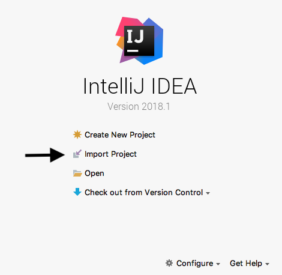
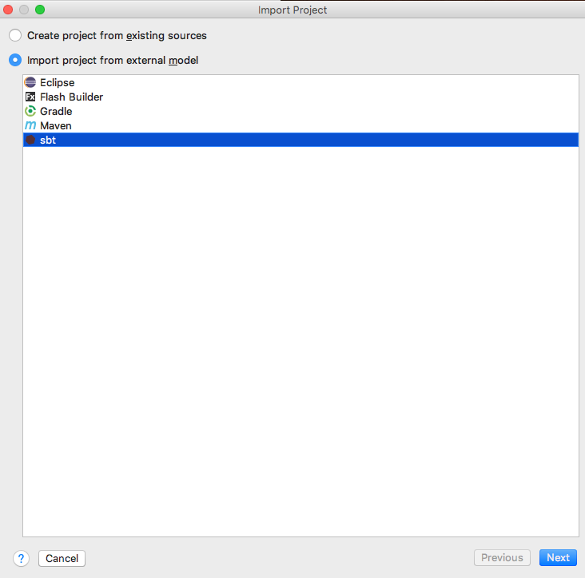
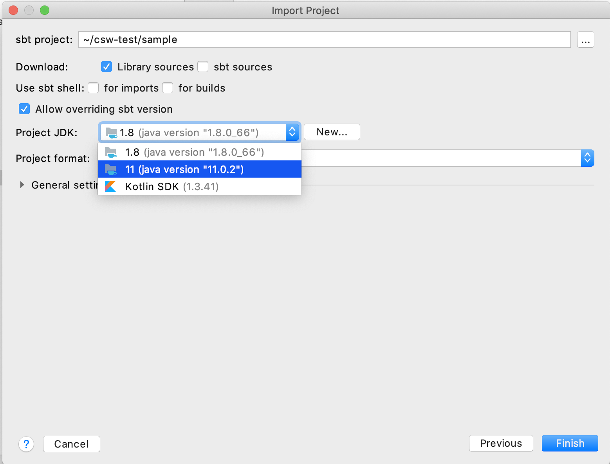
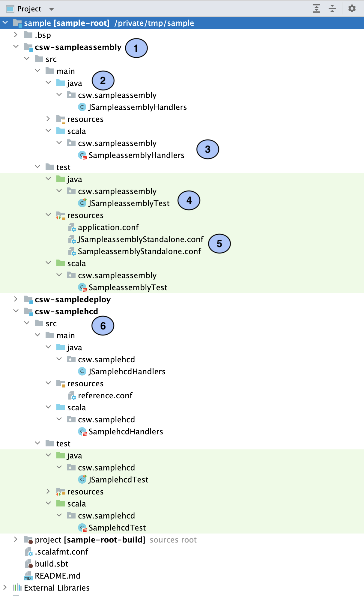
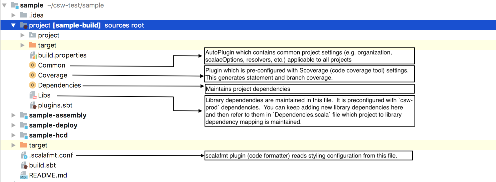

# Getting Started

In this tutorial, you’ll see how to create a Scala/Java project using a [giter8](http://www.foundweekends.org/giter8/) template for CSW ([csw.g8](https://github.com/tmtsoftware/csw.g8)) which contains sample handlers for creating HCD and Assembly. 
It also contains a deploy project which is responsible for starting multiple components or containers. You can use this as a starting point for your own projects for writing component. 
We’ll use the [sbt](https://www.scala-sbt.org/1.x/docs/index.html) build tool which compiles, runs, and tests your projects among other related tasks.

## Installation
Supported Operating Systems are: CentOS and MacOS
 
1.  Make sure you have coursier installed and set up along with Java AdoptOpenJDK 11 and sbt.
    Please refer to @ref:[coursier installation](../apps/csinstallation.md) for more details.
2. Install IntelliJ 
	- [MAC](https://www.jetbrains.com/idea/download/)
	- [Linux](https://www.jetbrains.com/idea/download/)
3. Install following IntelliJ Plugins
    - [Scala](https://plugins.jetbrains.com/plugin/1347-scala)
    - [Scalafmt](https://plugins.jetbrains.com/plugin/8236-scalafmt)
4. Install [Redis](https://redis.io/download) - Version should be greater than 4.0.0
5. Recommended testing frameworks/tools: 
	- [ScalaTest](https://www.scalatest.org/)
	- [JUnit](https://junit.org/junit4/), JUnit Interface
	- Note: These frameworks are typically downloaded and made available by the sbt tool by specifying them as dependencies.
	If you are using the [giter8 template](https://github.com/tmtsoftware/csw.g8) (see below), these dependencies are specified by default, and the sbt
	will resolve them when it runs.  


## Create project

1.  `cd`  to an empty folder.
2.  Run the following command  `sbt new tmtsoftware/csw.g8`. This pulls the ‘csw’ template from GitHub.
3.  Provide input details when prompted. Follow the template @link:[readme.md](https://github.com/tmtsoftware/csw.g8/blob/master/README.md) for detailed information about input parameters.


To open the project in IntelliJ, start IntelliJ and click on Import Project in the Intro dialog.  If you have a project already open, click on File -> New -> Project from Existing Sources...   



Then select the directory created by the template and click Open.

You will then see a dialog asking how to import the project.  



On the next dialog, click the Project JDK dropdown and select Java 11.



Then click Finish to create the project.  Once IntelliJ loads with the new project, you may have to import changes
to properly load it.

Let’s take a look at what just got generated:

In this example, a project was created with default parameters.  Below, we show some pictures and outline the project 
structure.  Much of what is described below is described in more detail on the subsequent pages.

As you can see in below snapshot, template will create three projects:

    - `csw-sampleassembly`
    - `csw-samplehcd`
    - `csw-sampledeploy`
    


1. This shows where the module for the assembly is located, called `csw-sampleassembly`

2. The template generates handlers for both Java and Scala.  Both are not required to develop a 
component.  After you choose which language you want to develop in, you can delete the other.  We encourage you
to use Scala!  It has good support for asynchronous programming.

3. This is the handlers class where you implement your custom logic.

4. The template creates an example test fixture for testing your code in both Java and Scala.

5. Sample component configuration files are created to facilitate testing.  The actual component configuration files
needed for running your component are located in the deploy module (see below). 

6. The HCD code is in a separate module here.

The following diagram shows the deploy folder and the project folder:


1.  `csw-sampledeploy` project is used to create a concrete implementation.  This allows for the construction of a complete binary
package bundled with all dependencies, and a launching application.  This part shows the configuration files used in
component or container construction.

2. These are the applications used for component and container construction.  These don't need to be modified.

3. This folder contains the project build settings, along with the build.sbt file.  You shouldn't have to modify anything
here other than your dependencies (see below).
 
4. If you need to add a library or other dependency to you project, the Dependencies and Libs files may need to be updated.
Libs contains a list of all external libraries, and Dependencies indicate which libraries are used by each module.  The
template comes with `csw` and other useful library dependencies already included. 



## Add new sbt project module

If you want to add another component to the project, for example, with the name `sample-io`, you have to create a new sbt module:

1. Add external library dependencies required by `sample-io` in `Libs.scala` file, if it does not exist.
```
val `akka-actor` = "com.typesafe.akka" %% "akka-actor" % "2.6.1"
```
2. Map new/existing library dependencies in `Dependencies.scala` file against new project.
```
val SampleIO = Seq( Libs.`akka-actor` )
```
3. Include below snippet in `build.sbt` file, this will create new sbt project module.
```
lazy val `sample-io` = project
  .settings( libraryDependencies ++= Dependencies.SampleIO )
``` 
4. If your new module depends on code from other modules within this project, use `.dependsOn` in your build.sbt file:
``` 
lazy val `sample-io` = project
  .settings( libraryDependencies ++= Dependencies.SampleIO )
  .dependsOn(
    `sample`,
    `samplehcd`
  )
```
5. Update the deployment dependencies:
``` 
lazy val `sample-deploy` = project
  .dependsOn(
    `sample`,
    `samplehcd`,
    `sample-io`
  )
```
