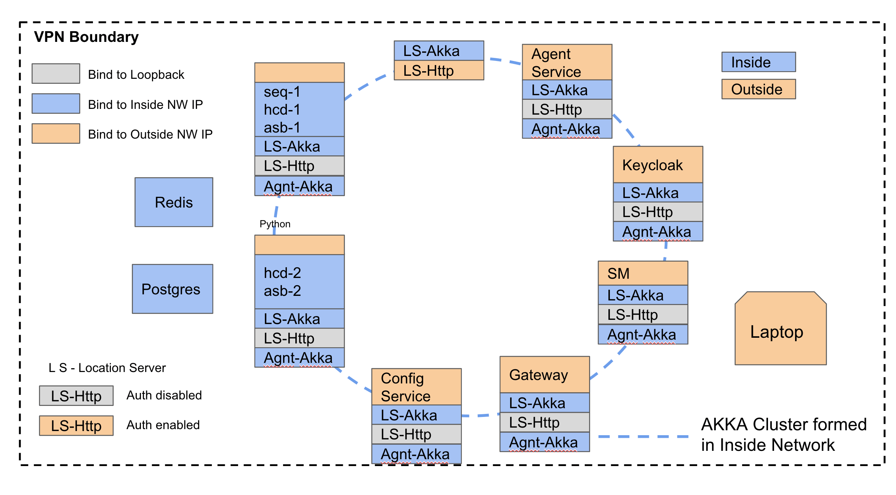

# Network Topology 

There are two network in this network topology.

* Both these networks are withing VPN
* A `process/service/component` which is accessible within `Inside` network is not protected by auth.
* A `process/service/component` which is exposed to `Outside` network is protected by auth.
* `Akka cluster` is formed in Inside network
* A `machine` can connect to both networks using two NICs, if it has a use case, where the application in it
 needs to access both networks.
* A `process/service/component` running in the `machine` can choose to bind and register itself to one network even if
 machine itself is connected to both networks. In such cases, the `process/service/component` can be reached using that
  single network IP only.

## Examples

* Gateway should be accessed in `Outside` network, hence it is auth enabled and its public IP is registered with location
 service.
* HCD/Assembly should be accessed within `Inside` network only, hence their private IP is registered with location service

## Terminologies

* `Private` and `Inside` network means the same thing 
* `Public` and `Outside` network means the same thing 

