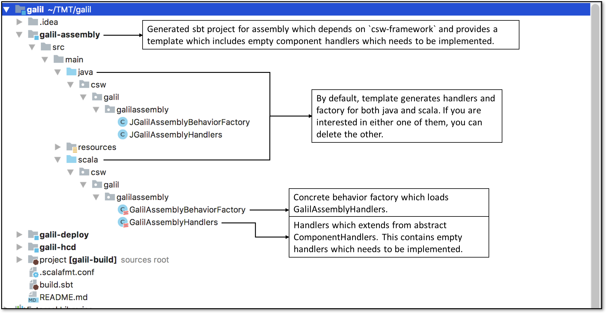
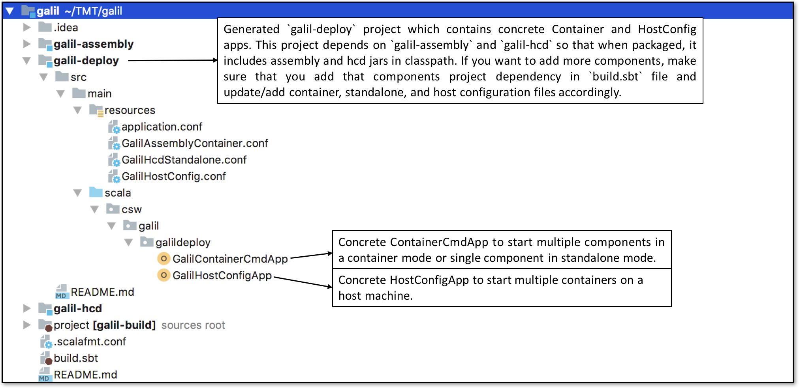
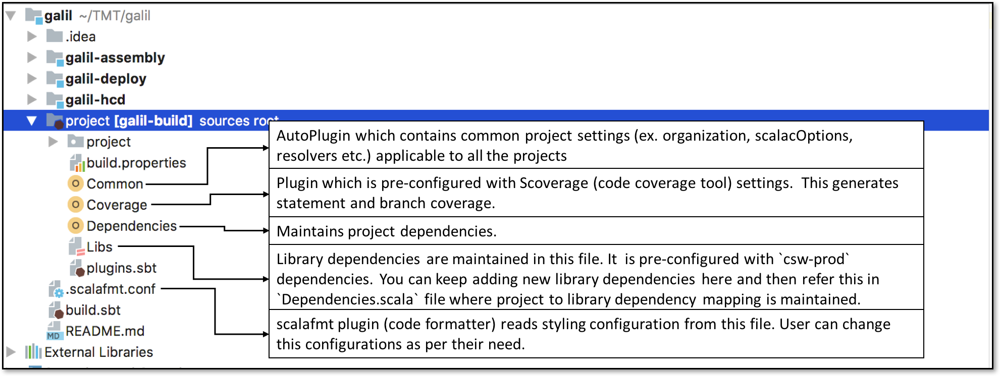

# Getting Started

In this tutorial, you’ll see how to create a Scala/Java project from a [csw.g8](https://github.com/tmtsoftware/csw.g8) template which contains sample handlers for creating HCD and Assembly. 
It also contains a deploy project which is responsible for starting multiple components or containers. You can use this as a starting point for your own projects for writing component. 
We’ll use  [sbt](http://www.scala-sbt.org/1.x/docs/index.html) build tool which compiles, runs, and tests your projects among other related tasks.

## Installation

1.  Make sure you have the Java 8 JDK (also known as 1.8)
    -   Run  `javac -version`  in the command line and make sure you see  `javac 1.8.___`
    -   If you don’t have version 1.8 or higher,  [install the JDK](http://www.oracle.com/technetwork/java/javase/downloads/index.html)
2.  Install sbt
    -   [Mac](http://www.scala-sbt.org/1.x/docs/Installing-sbt-on-Mac.html)
    -   [Linux](http://www.scala-sbt.org/1.x/docs/Installing-sbt-on-Linux.html)
3. Install IntelliJ 
	- [MAC](https://www.jetbrains.com/idea/download/#section=mac)
	- [Linux](https://www.jetbrains.com/idea/download/#section=linux)
4. Install Intellij Plugins
    - Scala
    - Scalafmt
5. Supported OS are: CentOS and MacOS
6. Testing frameworks/tools: 
	- [ScalaTest](http://www.scalatest.org/)
		- [csw-prod](https://github.com/tmtsoftware/csw-prod) uses `scalatest` as a primary testing framework for writing scala tests which is recommended for component writers. 
		- [giter8](github.com/tmtsoftware/csw.g8) template includes `scalatest` dependency. 
	- [JUnit](https://junit.org/junit4/)
		- [csw-prod](https://github.com/tmtsoftware/csw-prod) uses `junit` as a primary testing framework for writing java tests  which is recommended for component writers. 
		- [giter8](https://github.com/tmtsoftware/csw.g8) template includes `junit` dependency. 
		- To run junit tests via sbt , `junit-interface` dependency needs to be added which [giter8](https://github.com/tmtsoftware/csw.g8) template already includes.


## Create project

1.  `cd`  to an empty folder.
2.  Run the following command  `sbt new tmtsoftware/csw.g8`. This pulls the ‘csw’ template from GitHub.
3.  Provide input details when prompted. Follow [readme.md](https://github.com/tmtsoftware/csw.g8/blob/master/README.md) for detailed information about input parameters.
4.  Let’s take a look at what just got generated:

For example, project was created with default parameters, then complete project structure looks like this:

1.  As you can see in below snapshot, template will create three projects:
    - `galil-assembly`
    - `galil-hcd`
    - `galil-deploy`

2.  `galil-deploy` project contains concrete implementation

3.  Template comes with `csw-prod` and other useful library dependencies. It also includes bunch of plugins as explained in below snapshot


## Add new sbt project module

If you want to add a new project with name `galil-io`, then follow below steps:

1. Add library dependencies required by `galil-io` in `Libs.scala` file, if it does not exist.
```
val `akka-actor` = "com.typesafe.akka" %% "akka-actor" % "2.5.11"
```
2. Map new/existing library dependencies in `Dependencies.scala` file against new project.
```
val GalilIO = Seq( Libs.`akka-actor` )
```
3. Include below snippet in `build.sbt` file, this will create new sbt project module.
```
lazy val `galil-io` = project
  .settings( libraryDependencies ++= Dependencies.GalilIO )
``` 

## Running Components

Make sure you add dependency of your component in the `galil-deploy` project.
To start galil Assembly and HCD, follow below steps:

 - Run `sbt galil-deploy/universal:packageBin`, this will create self contained zip in `target/universal` directory
 - Unzip generated zip and enter into `bin` directory
 - Run `galil-container-cmd-app` script or `galil-host-config-app` script
 - Ex.  `./galil-host-config-app --local ../../../../galil-deploy/src/main/resources/GalilHostConfig.conf -s ./galil-container-cmd-app`

Note: the CSW Location Service cluster seed must be running, and appropriate environment variables set to run apps.
See https://tmtsoftware.github.io/csw-prod/apps/cswclusterseed.html .
>>>>>>> master
