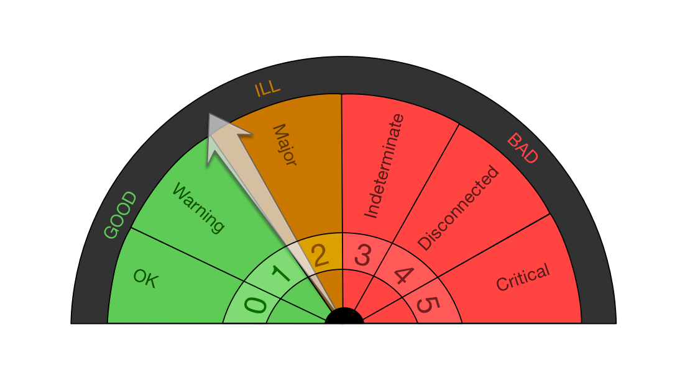
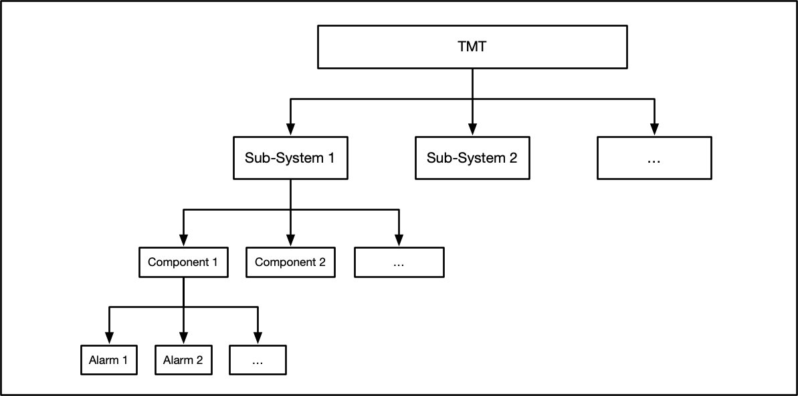
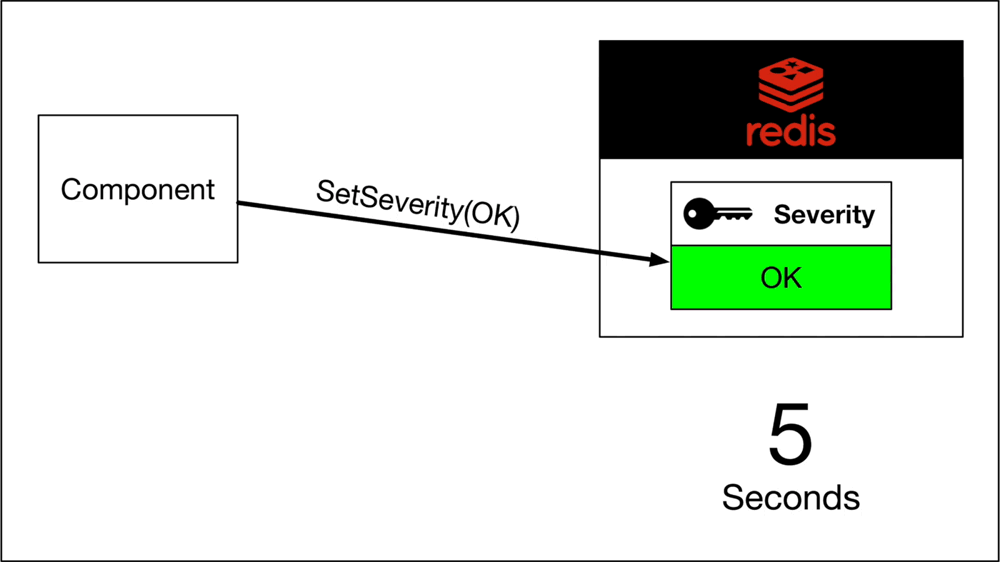
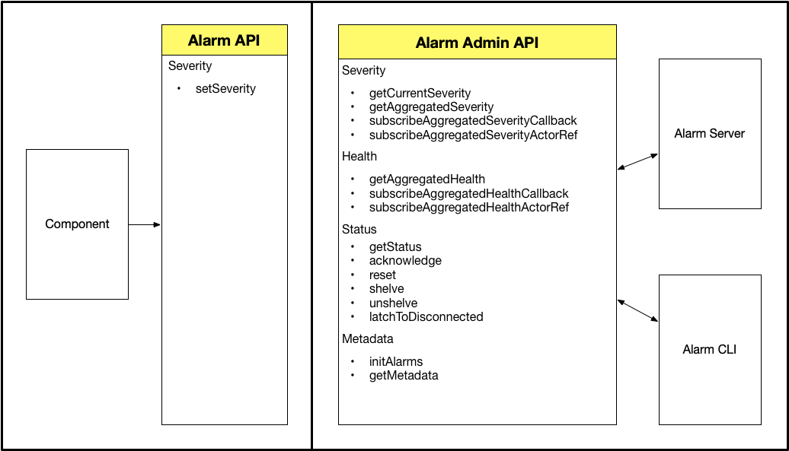
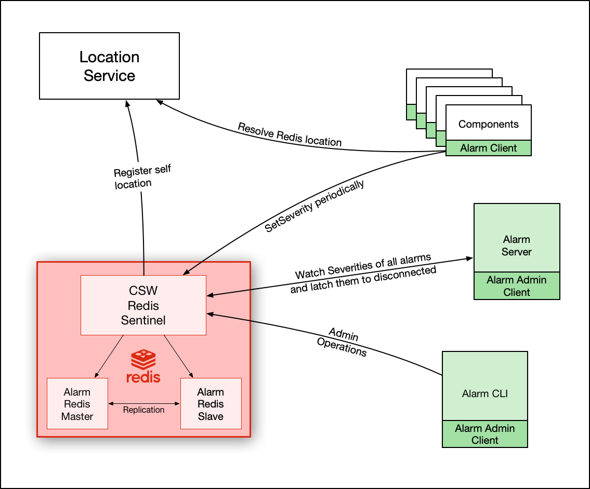

# Alarm Service

## Introduction

Alarm Service in TMT software is used by components to raise alarms. 
Alarms could be of different severities such as Warning, Critical, etc. 
The alarm system also provides mechanisms to monitor the health of all components 
and subsystems in TMT.

## Technology

Alarm Service uses [Redis](https://redis.io/) for persistence. Redis provides 
[Keyspace Notifications](https://redis.io/topics/notifications) which allows clients to subscribe to Pub/Sub channels 
in order to receive events affecting the Redis data set in some way.


We have created a layer i.e. "Romaine" which converts redis events into an [akka stream](https://doc.akka.io/docs/akka/current/stream/index.html).
Romaine internally uses a java redis library called [Lettuce](https://lettuce.io/).

## Severities

An alarm can have one of the following severities at a given time

| Severity Name  | Severity Level  |
|---:|:---:|
| `Okay`  | 0  |
| `Warning`  | 1  |
| `Major`  |  2 |
| `Indeterminate`  | 3  |
| `Disconnected`  | 4  |
| `Critical`  |  5 |

## Health

Health is a higher level abstraction created on top of severities. One or more alarms can be combined to calculate
one of the following healths at a given time.

- `Good`
- `Ill`
- `Bad`
 
Health is calculated based on severity. A mapping between health and 
severities is shown in the figure below.



## Severity & Health Aggregations

A severity can be associated with an alarm, a component or a sub-system.

Unlike alarms, which has a direct association with severity, components 
and sub-systems don't have a direct association with severities. 
They have aggregated severities based on severities of their children.



A components aggregated severity is equal to severity of its child alarm with "maximum" severity.
Similarly, a sub-system's aggregated severity is determined by its child component with maximum severity.

Health aggregation works on top of severity aggregation. A components aggregated health is calculated by first
calculating its aggregated severity and then mapping it to health. Sub-System health aggregation works in the same way.

## Redis Storage


### Metadata

Metadata of an alarm is static information about an alarm such as name, 
description, subsystem, component, etc. This information is not changed during runtime.
Since the metadata is static, entire metadata of an alarm is stored against a single redis key in json 
format for easy retrieval. The static information is contained in a configuration file and loaded when Alarm Service 
starts up.
The key name is formed with pattern: `metadata-[SUBSYSTEM_NAME]-[COMPONENT_NAME]-[ALARM_NAME]` 
e.g. `metadata-nfiraos-trombone-tromboneaxislowlimitalarm`.

The sample JSON below, shows structure of typical alarm metadata from the configuration file

```json
{
   "subsystem":"tcs",
   "component":"corrections",
   "name":"outOfRangeOffload",
   "description":"Another system has sent an out of range offload that has caused the system to go into a bad state!",
   "location":"Computer Room",
   "alarmType":"absolute",
   "supportedSeverities":[
      "warning",
      "major",
      "indeterminate",
      "okay"
   ],
   "probableCause":"Bad software in NFIRAOS or WFOS",
   "operatorResponse":"Reset the software system and hope",
   "isAutoAcknowledgeable":false,
   "isLatchable":true,
   "activationStatus":"active"
}
```

### Acknowledgement Status

Indicates Acknowledgement status of an alarm. The key name is formed with pattern `ackstatus-[SUBSYSTEM_NAME]-[COMPONENT_NAME]-[ALARM_NAME]`.
e.g. ackstatus-nfiraos-enclosure-temphighalarm

Possible values of this key are: 

- `acknowledged`
- `unacknowledged`

### Severity

Indicates the current severity of an alarm. The key name is formed with pattern 
`severity-[SUBSYSTEM_NAME]-[COMPONENT_NAME]-[ALARM_NAME]`.  
e.g. `severity-nfiraos-trombone-tromboneaxislowlimitalarm`

This key can contain one of the following values at a given time -

- `okay`
- `warning`
- `major`
- `indeterminate`
- `critical`

If the value is not present, it is considered to have `disconnected` severity.

### Latched Severity

Indicates the severity on which the current alarm is latched. A latched severity is the max severity of an alarm since last reset operation.
The key name is formed with pattern `latchedseverity-[SUBSYSTEM_NAME]-[COMPONENT_NAME]-[ALARM_NAME]`. e.g. `latchedseverity-tcs-tcspk-cpuexceededalarm`

Possible values of this key are: 

- `okay`
- `warning`
- `major`
- `indeterminate`
- `critical`
- `disconnected`

### Shelve Status

Indicates shelved status of an alarm. The key name is formed with pattern 
`shelvestatus-[SUBSYSTEM_NAME]-[COMPONENT_NAME]-[ALARM_NAME]`.  e.g. `shelvestatus-nfiraos-trombone-tromboneaxislowlimitalarm`

This key can have one of the following values

- `shelved`
- `unshelved`

If no value is present, it is inferred as `unshelved`

### Alarm Time

Indicates the time of the last severity change of an alarm. The key name is formed with pattern 
`alarmtime-[SUBSYSTEM_NAME]-[COMPONENT_NAME]-[ALARM_NAME]`. e.g. `alarmtime-nfiraos-beamsplitter-splitterlimitalarm`

The value is stored in the format: `2019-04-03T11:09:28.404143Z`

### Initializing

Indicates whether alarm is initializing or its initialization is finished. It contains a boolean value either `true` or `false`

The key name is formed with pattern 
`initializing-[SUBSYSTEM_NAME]-[COMPONENT_NAME]-[ALARM_NAME]`. e.g. `initializing-lgsf-tcspkinactive-cpuidlealarm`

## Alarm Disconnection

All the severities except `Disconnected`, need to be set explicitly. `Disconnected` is a special severity in the sense that it
can never be set by a component explicitly and is always inferred when there is no severity value has been set. 
Alarm service uses [Heartbeat pattern][1].

Whenever a component calls `SetSeverity`, severity get stored in redis for that alarm with certain _TTL_. This TTL is configurable. 
For our example, let's assume it is 5 seconds. A TTL of 5 second means that if another call to `SetSeverity` is not made **within** 5 seconds, 
the current severity will get deleted from redis. Absence of severity is inferred as "Disconnected" severity. 


So to avoid disconnection of an alarm, the component will need to ensure that a `SetSeverity` call (aka heartbeat) is
made with appropriate severity at-least once in every 5 seconds.



[1]: https://en.wikipedia.org/wiki/Heartbeat_(computing)

@@@note 

Actual TLL depends on `refresh-interval` & `max-missed-refresh-counts` configurations. For example,
if `refresh-interval` is set to `3s` (3 seconds) and `max-missed-refresh-counts` is set to 2, alarm will 
get disconnected after 6 seconds (3 * 2)

@@@

Using the heartbeat pattern allows us to detect dead or disconnected components automatically
without polling them at regular intervals.

## Severity Latching

[Alarm metadata](#metadata) JSON has a boolean attribute called "isLatchable". This determines the latching behaviour of an alarm. If an
alarm is latchable, its latched severity _sticks_ to the last highest severity reached until the alarm is reset. 
Reset operation is provided the [admin api](#api-structure) of alarm service.


For, alarms which are not latchable, latched severity will always be equal to severity.

Setting severity and latched severity both is done by `SetSeverity` api. As described in previous sections,
when a component dies, it can't call `SetSeverity` and the severity key in redis, expires.
However the "Latched Severity" is still not updated; which is a problem. To solve this problem, the future Alarm Server
subscribes to all severity changes (using akka stream api of alarm service) and whenever it detects a key has expired,
it updates its respective "latchedSeverity" value in Redis to `disconnected`.

## Shelving Alarms

Alarms can be shelved and un-shelved using the Alarm Service API. A shelved alarm will contribute to a subsystem's
aggregate severity and health.
An alarm can only be shelved for a predefined time. The time can be configured in Alarm Service configuration.
For example: 

```hocon
shelve-timeout = "8:00:00 AM" // format -> h:m:s a
```

When changing the shelve status to `shelved` it is set using `setex` operation of redis with an appropriate TTL
so that it gets expired on next `shelve-timeout`. Once expired, it is inferred as `unshelved`.

Alarms can also be un-shelved explicitly before next `shelve-timeout` occurs. `unshelve` api sets `unshelved`
value in redis explicitly without any TTL.

## Acknowledging Alarms

Alarms can be in either `ackowldged` or `unackowldged` state. See [Acknowledgement Status](#acknowledgement-status) for more details. 
The state can be changed to `ackowldged` by simply using `acknowledge` api of alarm service. Apart from this api,
setting severity can also change the Acknowledgement Status of an alarm.

Alarm can either be auto-acknowledgeable or not auto-acknowledgeable. This behavior is driven from [alarm metadata](#metadata).
When an alarm is not auto-acknowledgeable, whenever it's severity changes to anything except Okay, it's Acknowledgement Status becomes
`unackowldged`. If it is changing from any severity to Okay, Acknowledgement Status remains same.

When the alarm is auto-acknowledgeable, whenever it's severity changes to Okay, it's Acknowledgement Status becomes `ackowldged`.
If it changes to anything else, Acknowledgement Status remains same.

## API Structure



The Alarm Service is divided into two parts. First one is called, well, @github[AlarmService](/csw-alarm/csw-alarm-api/src/main/scala/csw/alarm/api/scaladsl/AlarmService.scala) and it is meant
for Components that are provided with one API i.e. `SetSeverity`

The other API is @github[AlarmAdminService](/csw-alarm/csw-alarm-api/src/main/scala/csw/alarm/api/scaladsl/AlarmAdminService.scala). This API allows administrative 
operations such as shelving alarms, subscribing for severity changes, acknowledging alarms, etc. 
This API is consumed from @github[alarm cli](/csw-alarm/csw-alarm-cli) and Alarm Server. This API is also used by
administrative clients such as engineering user interfaces to set the active versions of files.

The API doc for Alarm Service can be found @scaladoc[here](csw/alarm/api/scaladsl/AlarmService) and @scaladoc[here](csw/alarm/api/scaladsl/AlarmAdminService).

Detailed documentation about how to use these APIs is available @ref:[here](../../services/alarm.md). 

## Architecture



@@@warning { title=Important }

At the time of writing this documentation, the Alarm Server does not exist. It will be developed in future as part of
ESW.HCMS. Its description and scope of work is subjected to change

@@@

For alarms to function, it is necessary that Redis instance is registered with Location Service.
Redis here is configured similar to other services in CSW.
There is a master Redis instance and a slave Redis instance. They are configured in "replication" mode.
There is a Sentinel instance who's responsibility it is to promote the slave as master when master goes down. It is important to note that when master
goes down, the "location" of Alarm Service remains the same because the location of Alarm Service is the location of Sentinel and not of master or slave.
The master and slave Redis instances are dedicated for alarm, however Sentinel is shared across CSW Redis-based services.

Once location is registered, components, alarm CLI & Alarm Server can resolve Redis location and start 
interacting with it using the component alarm API & alarm admin API. While the interaction of components with Alarm Service is limited to the `setSeverity` API,
Alarm CLI can perform all admin operations as discussed [above](#api-structure).

Alarm Server is part of ESW.HCMS and is not yet built. When built, its functionality will be to watch 
all severity changes using the admin API and [latch](#severity-latching) appropriate alarms to disconnected severity. 
Apart from this, it will also be responsible for logging alarms and generating alarm events for 
archiving in DMS.ENG. It provides an HTTP interface for various UI layer ESW.HCMS applications for 
alarm and health visualisations.
